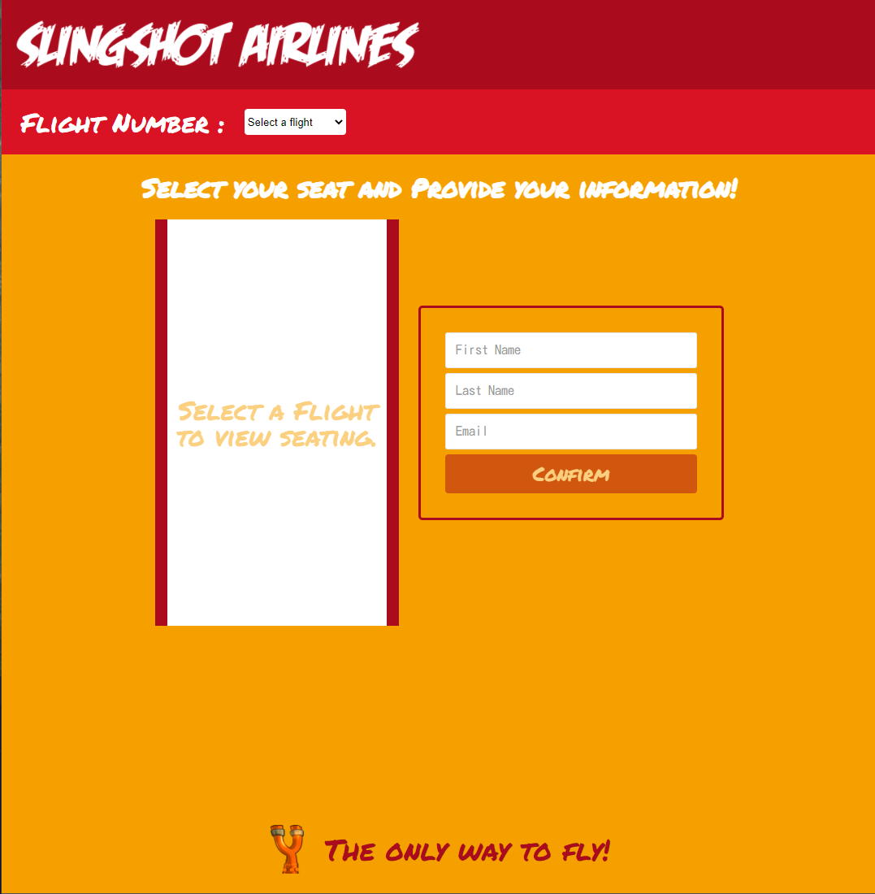

# Node.JS Project: SlingAir!


Full Stack web application for booking air seats.

## The App

### Screenshots




---

### Functionality

- When a user navigates to `http://localhost:3000`, they are presented with a dropdown to select the flight number.
- With the flight number, make a request to the server for the seating availability on that flight.
- When a response with seating is received, display the seating input as well as the form requesting user's information.
- User selects a seat, enters information and clicks 'Confirm'.
- Contact the server with the data, and wait for a success response to redirect to the `/confirmation` page.
- The confirmation page should display a confirmation message to the user with the info that they entered on the previous screen.
- Consider using `localStorage` to save the reservation id, to allow for retrieval if the user closes and reopens the browser at `/reservation`.

### Backend

1. Server endpoints are RESTful.
2. There are endpoints for the following actions:
   - Retrieve all flight numbers.
   - Retrieve single flight data.
     - Get all the seats of a specified flight.
   - Retrieve all reservations.
     - **_Must work through Insomnia._**
     - **_Having a FE component do this is a stretch goal._**
   - Retrieve a single reservation.
   - Create a reservation.
     - Needs to modify the `reservations` collection.
     - Needs to modify the `flights` collection.
   - Delete a reservation.
     - Needs to modify the `reservations` collection.
     - Needs to modify the `flights` collection.
     - **_Must work through Insomnia._**
     - **_Having a FE component do this is a stretch goal._**
   - Update a reservation.
     - Needs to modify the `reservations` collection.
     - Needs to modify the `flights` collection.
     - **REQUIRED: Change the first name, last name, email, and/or seat number.**
     - **STRETCH: Change the flight number.**
     - **_Must work through Insomnia._**
     - **_Having a FE component do this is a stretch goal._**
3. Server should respond in a _complete_ fashion:
   - Send the status and the `json` separately.
   - Send the status in the `json` object as well.
   - When a request succeeds respond with `the requested data`.
   - When a request fails, respond with `the data that was sent to the server`. _This makes it easier for FE developers to debug their code._
   - When a request does not need any data to be returned, provide a message explaining the status: i.e. "reservation deleted."

```js
res.status(200).json({ status: 200, data: {}, message: "" });
```

---

### Frontend

1. User can select a flight from a dropdown.
2. User can select an available seat.
3. User can enter their personal information.
4. User can view the flight confirmation page after booking a seat.
   - The confirmation page should `fetch` the details of the reservation from the backend based on it's unique `id`.
5. The reservation button in the header should only appear once a reservation has been made.
6. The reservation page should `fetch` the details of the most recent reservation from the backend based on it's unique `id`.
   - **Showing multiple reservations is a stretch goal.**

> The frontend is mostly complete, look for the `TODO` comments in the components to figure out what needs to be done!

---

### Database Integration: MongoDB

